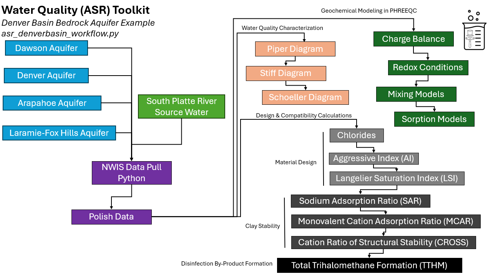

# wqtoolkit
Water Quality Analysis Toolkit with Denver Basin Bedrock Aquifer ASR Example

### Process Digram for Toolkit in asr_denverbasin_workflow.py

### Environment Set-up to run asr_denverbasin_workflow.py
1. set-up virtual environment
2. install requirements.txt in virtual environment with
     pip install -r requirements.txt
4. cd to local copy of repo and run asr_denverbasin_workflow.py
